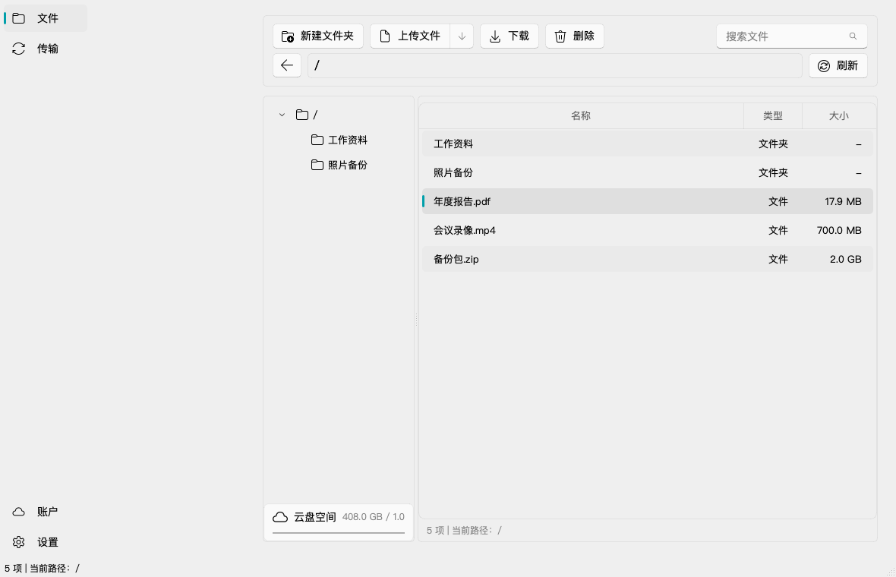
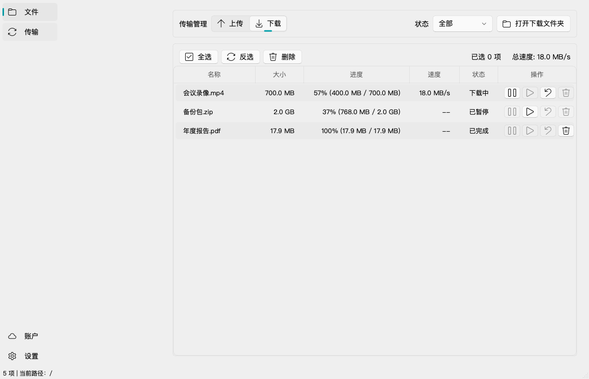
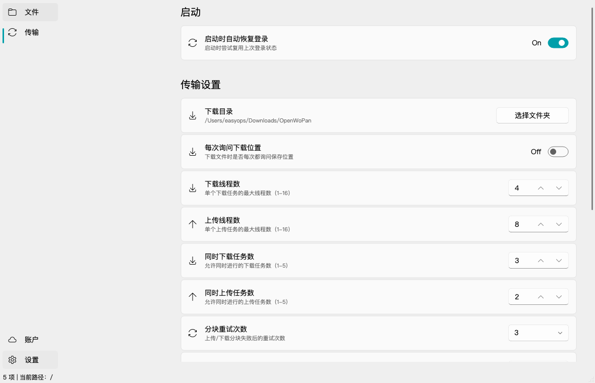

<div align="center">

# OpenWoPan

**中国联通云盘非官方桌面客户端 | 文件管理 · 多线程传输 · Fluent Design**

<div>
  <a href="./LICENSE"></a>
  
  
  
  
</div>

<br>



<sub>文件管理 · 文件夹树 · 面包屑导航 · 云盘空间</sub>

</div>

---

OpenWoPan 是面向中国联通云盘的开源桌面客户端。项目使用 PySide6 + PySide6-Fluent-Widgets 构建桌面界面，通过用户授权后的网页登录态访问联通云盘 Web 侧接口，提供文件管理、上传下载、传输中心和本地传输策略配置。

## 特性亮点

| 特性 | 说明 |
|:---|:---|
| 文件管理 | 浏览根目录和子目录，支持新建文件夹、重命名、移动、删除 |
| 上传下载 | 支持文件上传、文件下载、自动下载到指定目录和重名文件避让 |
| 多线程传输 | 下载/上传线程数、并发任务数、分片大小和重试次数可配置 |
| 断点续传 | 下载任务支持暂停、继续、取消、失败记录和续传状态展示 |
| 传输中心 | 上传/下载任务分 tab 展示，显示进度、速度、状态和批量操作 |
| 安全边界 | Cookie 保存到系统安全凭据存储，不写入普通配置文件 |
| Fluent Design | 基于 PySide6-Fluent-Widgets，界面风格对齐现代桌面应用 |
| 工程化 | pytest、ruff、mypy 覆盖核心流程和边界行为 |

## 界面展示

### 传输管理



> 任务进度 · 实时速度 · 暂停/继续/取消 · 状态筛选 · 批量删除

### 设置



> 下载目录 · 上传/下载线程数 · 并发任务数 · 分片大小 · 重试次数

## 安装

### 从源码运行

需要 [Python 3.12+](https://www.python.org/downloads/) 和 [uv](https://github.com/astral-sh/uv)。

```bash
git clone https://github.com/crmmc/OpenWoPan.git
cd OpenWoPan
uv sync
uv run openwopan
```

### 开发命令

```bash
uv run pytest
uv run ruff check src tests
uv run mypy src
OPENWOPAN_SMOKE_TEST=1 uv run openwopan
```

## 技术栈

| 组件 | 技术 |
|:---|:---|
| GUI 框架 | PySide6 + PySide6-Fluent-Widgets |
| HTTP 客户端 | httpx |
| 凭据存储 | keyring |
| 本地配置 | platformdirs + JSON |
| 包管理 | uv |
| 质量保证 | pytest + ruff + mypy |

## 项目边界

- 本项目不是中国联通或联通云盘官方客户端。
- 本项目不包含 OpenList 源码，OpenList 仅作为接口事实参考来源。
- 本项目不模拟账号密码登录，优先使用官方网页登录页获取用户授权后的 Cookie。
- Cookie、token、真实下载 URL、签名 URL 不应出现在 README、日志、截图或普通配置文件中。

## 许可证

[MIT](./LICENSE)

## 免责声明

本项目为个人学习与技术研究目的开发，与中国联通、联通云盘官方无任何关联。使用本软件即表示您已知晓并同意以下内容：

- 本软件按「现状」提供，不提供任何明示或暗示的保证。
- 开发者不对因使用本软件导致的任何直接或间接损失承担责任，包括但不限于数据丢失、账号异常、服务中断等。
- 使用者应自行承担使用本软件的全部风险，并遵守联通云盘用户协议及相关法律法规。
- 请勿将本软件用于违反服务条款或法律法规的用途。

---

<div align="center">
由 OpenWoPan contributors 维护
</div>
